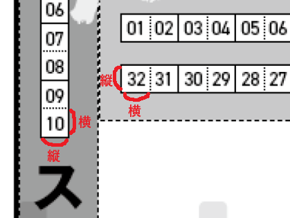
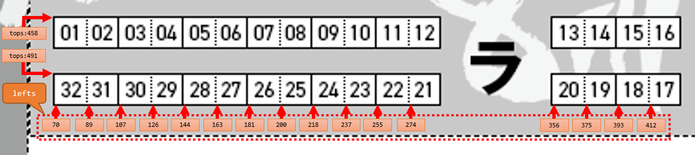
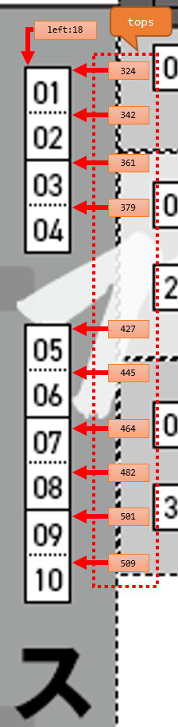

# ABOUT
チェックリストのマップ座標の作成方法

# INSTALL AND SETUP
## nodejs を入れる

nodejs はがんばってインストールする。

下記のように `node -v` と打ってエラーが出ずにバージョンが出れば OK。

```bash
$ node -v
v10.19.0
```

## セットアップ

一番最初のセットアップの際は、下記のコマンドを実行する。

```bash
$ git clone git@github.com:celeron1ghz/acceptessa-checklist.git

$ cd acceptessa-checklist/dev

$ npm install
```

前回の操作から間が空いた際は、下記のコマンドを実行して最新のものに更新する。

```bash
$ cd acceptessa-checklist/dev

$ git pull --rebase

$ npm install
```

# MAKE CONFIG
## サーバの起動
設定の内容をリアルタイムで確認できるようにするため、設定作成用のサーバを立ち上げる。

```
npm run start
```

だいたい下記のようなメッセージが出ればサーバは起動している。

```bash
Compiled successfully!

You can now view acceptessa-checklist in the browser.

  Local:            http://localhost:3000
  On Your Network:  http://172.18.70.173:3000

Note that the development build is not optimized.
To create a production build, use yarn build.
```

エラーがなければブラウザが起動するので、起動されたブラウザで画面が表示されればOK。

## ファイルを置いて設定を作成する
以下の場所に対応するファイルを置く。

```
acceptessa-checklist
┗ dev
  ┗ config
    ┗ test
      ┣ config.yaml      （設定ファイル。これから書き方を説明）
      ┣ map.png          （マップとして表示されるファイル）
      ┗ not_uploaded.png （サークルカット未アップロード時に表示される画像）
```

サーバを起動した Terminal と別に Terminal を立ちあげ、下記のコマンドを実行する。`config.yaml` を変更するたびに自動で設定ファイルを生成してくれるようになる。

```bash
cd acceptessa-checklist/dev

npm run watchConfig
```

下記のような表示が出てエラーになっていなければ OK。あとは `config.yaml` を書いていく。

```bash
Start watching config...
```

## config.yaml の書き方

`npm run watchConfig` を実行していれば、 `config.yaml` を保存 → 設定ファイルの生成 → ブラウザの再読み込みが自動で走るので、設定ファイルに座標を記入して、ずれていないかどうかを画面で確認していく。

`config.yaml` が正しくないフォーマットだった場合にはエラーが表示されてマップが再表示されない場合があるが、その際はブラウザをリロードする。それでもだめだったらサーバを一回止めて再度起動する。

フォーマットは下記の通り。

```
space_width: 18
space_height: 17
tweet:
  url: "http://7fes.com"
  hashtags: "ナナフェス"
  related: "7fes_info"
horizontal_syms:
 - { sym: "シ", top: 315, lefts: [70, 89, 107, 126, 144, 163, 181, 200, 218, 237, 255, 274, 356, 375, 393, 412] }
 - { sym: "ト", top: 370, lefts: [70, 89, 107, 126, 144, 163, 181, 200, 218, 237, 255, 274, 356, 375, 393, 412] }
 - { sym: "ト", top: 403, idx: 17, lefts: [412, 393, 274, 255, 200, 181, 163, 144, 89, 70] }
 - { sym: "ラ", top: 458, lefts: [70, 89, 107, 126, 144, 163, 181, 200, 218, 237, 255, 274, 356, 375, 393, 412] }
 - { sym: "ラ", top: 491, idx: 17, lefts: [412, 393, 375, 356, 274, 255, 237, 218, 200, 181, 163, 144, 126, 107, 89, 70] }
vertical_syms:
 - { sym: "ス", left: 18, tops: [324, 342,361, 379, 427, 445, 464, 482, 501, 519] }
```

### space_width, space_height

サークルスペースの長辺（横）を `space_width`、短辺（縦）を `space_height` に指定する。



### tweet

Tweet ボタン押下時に表示する文言の設定。パラメータの意味やほかのパラメータなどは下記ページの _Tweet content parameters_ を参照。

https://developer.twitter.com/en/docs/twitter-for-websites/tweet-button/guides/parameter-reference1

### horizontal_syms

横に並んでいるサークルを記載するのに使用する。ない場合は書かなくてもいい。



座標を求めて、下記のように記入する。分らなかったら聞いてください。

```
 - { sym: "ラ", top: 458, lefts: [70, 89, 107, 126, 144, 163, 181, 200, 218, 237, 255, 274, 356, 375, 393, 412] }
 - { sym: "ラ", top: 491, idx: 17, lefts: [412, 393, 375, 356, 274, 255, 237, 218, 200, 181, 163, 144, 126, 107, 89, 70] }
```

### vertical_syms

縦に並んでいるサークルを記載するのに使用する。ない場合は書かなくてもいい。



座標を求めて、下記のように記入する。分らなかったら聞いてください。

```
 - { sym: "ス", left: 18, tops: [324, 342,361, 379, 427, 445, 464, 482, 501, 519] }
```

## commit&push して repository へ反映
マッピングの作成が完了したら、設定作成用のディレクトリ(dev)から本番用(client)のディレクトリにファイルを移動し、gitにファイルを登録してpushを行う。

```
acceptessa-checklist
┣ dev （ローカルで設定を作成する際にファイルを置いたところ）
┃ ┗ config
┃   ┗ test
┃     ┣ config.yaml
┃     ┣ map.png
┃     ┗ not_uploaded.png
┃
┗ client （本番で使われる設定ファイルを置くところ）
  ┗ config
    ┗ <即売会名>
      ┣ config.yaml
      ┣ map.png
      ┗ not_uploaded.png
```

ファイルを置いたらgitに登録し、repositoryへ反映する。

```bash
cd client/config
git add <即売会名>/config.yaml
git add <即売会名>/map.png
git add <即売会名>/not_uploaded.png

git commit -m "<即売会名>の設定ファイルを追加"

git push
```

その後Actionsでエラーが出ていないことを確認する。

エラーが出ていた場合は再度修正する。

以上。
